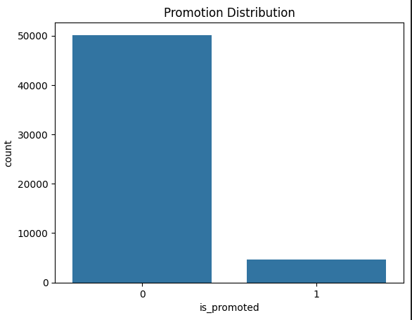
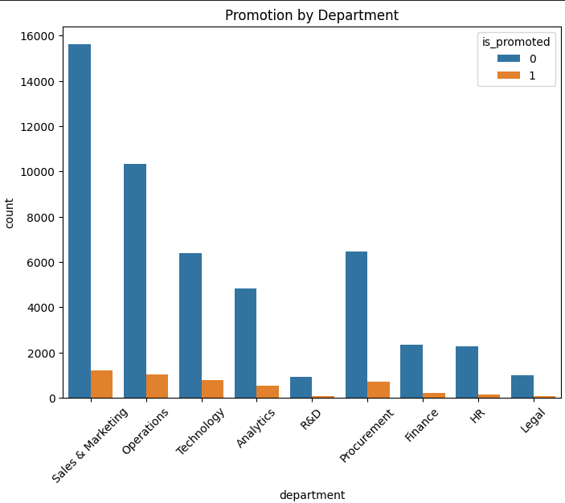
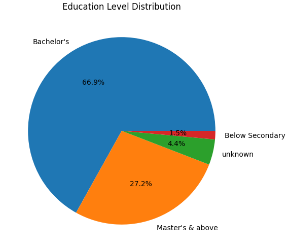
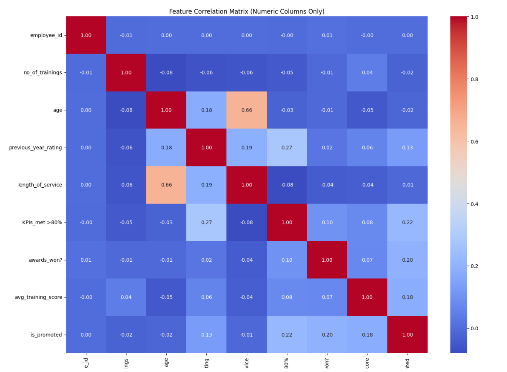
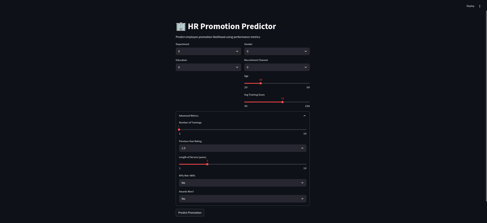

# HR Analytics Employee Promotion Prediction


A sophisticated machine learning pipeline to predict employee promotions using advanced feature engineering, model selection, and a production-ready Streamlit deployment. This project leverages encoded categorical features and a serialized `.pkl` model for seamless, real-time predictions.

---

## Overview

This project solves a real-world HR challenge for a large MNC: **identifying employees likely to be promoted** (manager and below) using historical performance, training, and demographic data. The aim is to expedite the promotion cycle by providing data-driven recommendations at key checkpoints.

---

## Key Features

- **Comprehensive EDA**: Visualizations for class imbalance, department-wise promotions, education distribution, and more.
- **Advanced Preprocessing**: Imputation of missing values, label encoding for categorical variables.
- **Feature Engineering**: Creation of binary features (e.g., `high_training_score`) and selection using SelectKBest, RFE, and Random Forest importance.
- **Class Imbalance Handling**: Applied SMOTE to balance the dataset.
- **Modeling**: Compared Logistic Regression, Decision Tree, Random Forest, and XGBoost.
- **Deployment**: Streamlit app using `.pkl`-serialized model and encoders for instant predictions.

---

## Dataset

- **Train:** 54,808 rows × 14 columns
- **Test:** 23,490 rows × 13 columns

**Features include:**
- `department`, `region`, `education`, `gender`, `recruitment_channel`
- `no_of_trainings`, `age`, `previous_year_rating`, `length_of_service`
- `KPIs_met >80%`, `awards_won?`, `avg_training_score`
- **Target:** `is_promoted` (0/1)

See [Data-Description.docx](data/Data-Description.docx) for full details.

---

## Exploratory Data Analysis


*Class imbalance in target variable.*


*Promotion rates by department.*


*Distribution of education levels.*


*Correlation matrix for numeric features.*

---

## Data Preprocessing

- Filled missing `education` with `"unknown"`, `previous_year_rating` with `0`.
- Label encoded categorical columns for model compatibility.
- Engineered `high_training_score` as `avg_training_score > 80`.

---

## Feature Selection

Combined three approaches for robust feature selection:

| Method           | Selected Features                                                                 |
|------------------|----------------------------------------------------------------------------------|
| SelectKBest      | education, gender, no_of_trainings, age, previous_year_rating, ...               |
| RFE              | department, education, no_of_trainings, age, previous_year_rating, ...           |
| Random Forest    | avg_training_score, age, length_of_service, department, previous_year_rating, ... |

**Final Feature Set:**  
`recruitment_channel`, `length_of_service`, `age`, `no_of_trainings`, `avg_training_score`, `KPIs_met >80%`, `education`, `previous_year_rating`, `department`, `gender`, `awards_won?`, `high_training_score`

---

## Model Training & Evaluation

| Model                | Accuracy | ROC AUC |
|----------------------|---------:|--------:|
| Logistic Regression  |   0.71   |   0.79  |
| Decision Tree        |   0.93   |   0.93  |
| **Random Forest**    | **0.95** | **0.99**|
| XGBoost              |   0.90   |   0.97  |

*Random Forest outperformed others and is used for deployment.*

---

## Deployment

- **Streamlit App**: User-friendly web interface for HR teams.
- **Model & Encoders Serialization**: All encoders and the Random Forest model are saved as `.pkl` files.
- **Live Demo**: [Streamlit Deployment Link](https://your-streamlit-app-url)  
  

---

## Usage

1. **Clone the repository**
    ```
    git clone https://github.com/your-username/hr-analytics-promotion-prediction.git
    cd hr-analytics-promotion-prediction
    ```

2. **Install dependencies**
    ```
    pip install -r requirements.txt
    ```

3. **Run the Streamlit app**
    ```
    streamlit run app.py
    ```

4. **Input employee data** in the web interface to get instant promotion predictions.

---

## File Structure

├── data/
│ ├── train.csv
│ ├── test.csv
│ └── Data-Description.docx
├── images/
│ ├── promotion_dashboard.png
│ ├── promotion_distribution.png
│ ├── department_promotion.png
│ ├── education_pie.png
│ ├── correlation_heatmap.png
│ └── streamlit_screenshot.png
├── model/
│ ├── random_forest_model.pkl
│ ├── encoders.pkl
├── app.py
├── requirements.txt
└── README.md

---

## Notable Visualizations

- **Promotion Distribution**  
  
- **Department-wise Promotions**  
  
- **Education Pie Chart**  
  
- **Correlation Heatmap**  
  
- **Streamlit App Screenshot**  
  

---

## Credits

- Data and problem statement provided by a InfoZ IT Solutons HR analytics.
- Developed & maintained by Siddharth K.

---

